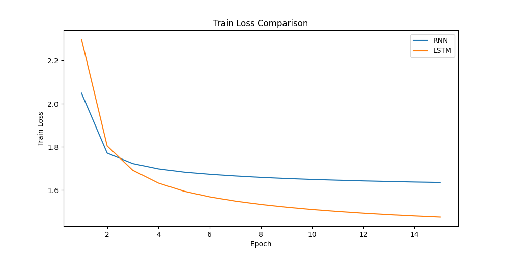
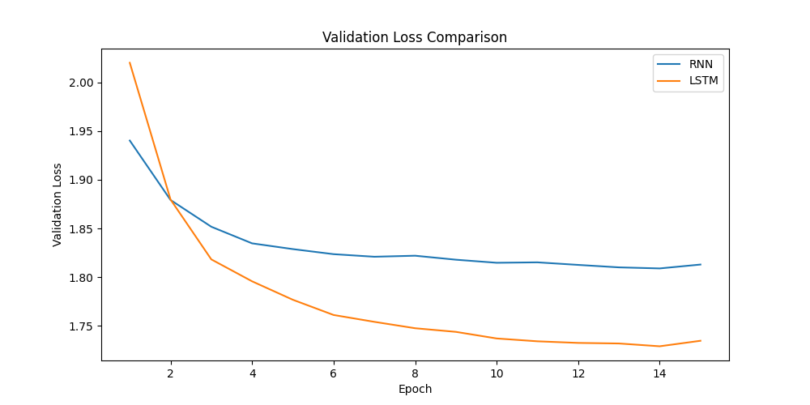

# 2024년도 1학기 인공신경망과 딥러닝 HW #3

## Language Modeling (RNN, LSTM)

### 모델 설명

해당 과제에서는 Vanilla RNN과 LSTM 두가지 모델을 구현하였습니다.

### Vanilla RNN
Vanilla RNN 모델은 간단한 Recurrence Neural Network 모델로 Hidden state를 이용하여 Squence data를 모델링합니다.
본 과제에서 구현한 Vanilla RNN 모델은 다음과 같은 구조를 가지고 있습니다.

- input size: character vocabulary size
- hidden layer size: 32
- output size: character vocabulary size
- number of layers: 3

### LSTM
LSTM(Long Short-Term Memory)은 장기 의존성 문제를 해결하기 위해 고안된 순환 신경망 구조입니다. 본 과제에서 구현한 LSTM 모델의 구조는 다음과 같습니다.

- input size: character vocabulary size
- hidden layer size: 32
- output size: character vocabulary size
- number of layers: 3

### Optimization
초기에 모델 구조를 은닉 노드 수 128, 레이어 수 5개로 설계하고 Adam optimizer를 사용하여 학습을 진행했습니다. 하지만 이 경우 학습 초기부터 검증 데이터셋에 대한 손실이 높아지는 과적합(overfitting) 현상이 관찰되었습니다.
이를 방지하고 모델의 일반화 성능을 높이기 위해 다음과 같은 조치를 취했습니다.

- hidden node size를 128에서 32로 줄임
- number of layer를 5에서 3으로 줄임
- Adam optimizer 대신 AdamW optimizer 사용

히든 노드 수와 레이어 수를 줄임으로써 모델의 용량(capacity)을 줄여 과적합 가능성을 낮추었습니다. 또한 AdamW optimizer를 사용함으로써 가중치 decay 정규화를 적용하여 일반화 성능을 향상시키기 위한 조치를 취했습니다. 이러한 조치 후 모델의 학습 곡선을 살펴보면, 초기 Overfitting 현상이 해소되고 검증 데이터셋에 대한 loss가 안정적으로 감소하는 것을 확인할 수 있었습니다. 결과적으로 더 간단한 모델 구조와 AdamW optimizer를 사용함으로써 Overfitting을 방지하고 일반화 성능이 향상된 모델을 얻을 수 있었습니다.

### 실험 결과
1. Train loss and Validation loss plot   

  
  

   

위 그림은 Vanilla RNN과 LSTM 모델의 Train loss 및 Validation loss를 epoch 별로 시각화한 결과입니다.   LSTM 모델이 Vanilla RNN 모델보다 전반적으로 낮은 손실값을 보이고 있으며, 검증 데이터셋에 대한 최종 손실값은 LSTM 모델이 1.92, Vanilla RNN 모델이 2.17로 LSTM 모델의 성능이 더 좋은 것을 확인할 수 있습니다.

2. Temperature parameter에 따른 generation 결과   

위 학습과정을 바탕으로 RNN, LSTM 모델의 각 Best model을 대상으로 generation.py를 통하여 문장을 생성하는 실험을 진행 하였습니다. 이 과정에서 temperature라는 변수를 도입하여 temperature 값에 따른 생성 결과를 비교하였습니다.

  $$y_i = \frac{exp(z_i/T)}{\sum_j exp(z_j/T)}$$

여기서 T는 temperature로, 확률분포의 형태를 조절합니다.

$T < 1$이면 높은 확률을 가진 후보가 더 강조되어 선택됩니다.   
$T > 1$이면 확률분포가 평평해져서 다양한 후보가 선택될 수 있습니다.   
$T = 1$일 때는 원래의 확률분포와 동일합니다.   

문장 생성 결과:

| Seed  | Temperature  | RNN Generated Text  | LSTM Generated Text  |
|:-:|:-:|:-:|:-:|
| H  | 0.5  | He dead's and the comment him deed the marker, whom he have the say to have worthy man the good too s  | How the sease of some prison the people, and therefore, be wish to be so did with a present me for hi  |
|   | 1.0  | Heaciplour him him.\n\nFirss with but hut.\nThounates url in my case made part as ney and in, you, till  | Hhou made as I livest such you?\n\nBoth wited spastinanced,\nThe infals; you his handlamies his refatain  |
|   | 2.0  | Hin slo, ly fruvined am rattiuf thus Keasors\n,? Prenn everged\nFakemt concoxvolk\nin poRay Irester-Mais  | HHee\nMnit:\nHeinby\nOl thts.\nC-DLUCTUSINESTER:-pefreaf.-\n\nGECINEEDGUSTEYW:\n'Twer, frothey, 'Fr his Licy  |
| T  | 0.5  | The much he strow hand and me conter, I have down and him the consul and a singlace, I have with and  | The much he strow hand and me conter, I have down and him the consul and a singlace, I have with andThat I will within well to with eye more of him but a charcius, and here, and in the part say he hath  |
|   | 1.0  | Thin a had, men to trull worm gulary kingly make fully be the done go I are spair eye halse the count  | Thin a had, men to trull worm gulary kingly make fully be the done go I are spair eye halse the countThen yet have latmoak.\n\nMARCIUS:\nYea!\nShouse, facefud\nThan eyes than should shall purfed dy his waily  |
|   | 2.0  | T; Pied yoCWVO\nUNEmer peep whik, sety Pritmices: Lany huu?\nFoy honeirewefodh. NOfnoOBu girdinly deedt  | Ans of so did can thinks for his news speak'st our false to all their heaven would death, \nAnd strengt  |
| A  | 0.5  | An with the do your part than a down and my pile that to my part there a brother the more be the sire  | ANNE:\nWhy, I cranks!\nWith\nBut well\nFpided, and the friend to con with here: if it can him\nI chant you  |
|   | 1.0  | And I arural.\n\nMARVALADYate,\nO-reat I on do? this our macg shes agrieds hoapling whet hard, you shoul  | Aunds,\nK: boysbne\nAlorgiki'y, tell hopIt\nfpiteoven in foot; ye've mile. Higme,\nLet 'afer name\nYir cni  |
|   | 2.0  | ANFEDIA:.\nLoaet genefivy.\n;rees nor, is,hs.t--OLis xtinbbly, takey,\nOwriter\nRy cut,\nAdalost jeg EvFyi  | MENENIUS:\nO, the gods that have country the people, that I have peaces of his friends, and in your wo  |
| M  | 0.5  | Marce of the man the gone him.\n\nMENENIUS:\nI will the content blannot the man him be before he would w  | MENENCES:\nWe are that let not the not, you be abpt val loust wa, and trimes\nin men--Busheld\nhild.\n\nSeMINIUS:\nI'll be like sextiness of Rome, we more\nWas lende lefence, for in mercy's regoin.\n\nMENENIUS:\n  |
|   | 1.0  | e not, you be abpt val loust wa, and trimes\nin men--Busheld\nhild.\n\nSe  | MINIUS:\nI'll be like sextiness of Rome, we more\nWas lende lefence, for in mercy's regoin.\n\nMENENIUS:\n  |
|   | 2.0  | Mg,,\nVoy\nWus\nUnle\nopitg? Cagumrpulrlk:\nod SercOO\nNWApvaknbog yow? kDone',\nNerutiEm.o\nLeheifkin,. MIye  | Mg,,\nVoy\nWus\nUnle\nopitg? Cagumrpulrlk:\nod SercOO\nNWApvaknbog yow? kDone',\nNerutiEm.o\nLeheifkin,. MIyeMedair. This, day's evers,\nEffievor 'nosient; assI\nI'skg wish targe't'd\nIs in foor mark.\nOlld, qnijuw  |
| S  | 0.5  | S:\nThe child to the come to the singly man and their the change to the the consul a for the grant tha  | S:\nWe wish against the carters; and speak to the stand to his sure is the pain and nor shall not soul  |
|   | 1.0  | SICINS:\nAs libut:\nCalakel home;\nI have eneral me!\nBeap.\n\nVOLUMNIA:\nBod I were not itess hand! affones  | SY:\nMarcout within, beseech here.\n\nCORIOLANUS:\nSo shands with our often, bear to whice your noblent\nT  |
|   | 2.0  | Solvy Will boy wie\nghuse's from NVCorie\nwrive non, and loovet Vooolongs. yow's?\nYEy\nip?\n'ER:\nO, tr''l  | SAEU MOZA:\nAst:' jikdst-qseeitboms brovlen.' Thy\nfor\nBot! I meicchpal\nvinddlady tocdue but prraes?\nSP  |

실험 결과를 살펴보면 다음과 같은 특징을 관찰할 수 있습니다.

Temperature가 0.5일 때: 생성된 문장들이 가장 그럴듯하고 문법적으로 안정적입니다. 학습 데이터와 매우 유사한 패턴의 문장들이 생성되어 다양성은 떨어지지만, 가독성과 자연스러움이 가장 높게 나타났습니다.   
Temperature가 1.0일 때: 문법적 오류가 종종 발견되기 시작했습니다. 0.5에 비해 다양한 표현들이 등장하지만, 동시에 어색한 문장 구조나 단어의 조합도 눈에 띕니다.   
Temperature가 2.0일 때: 문법적 오류와 비문이 매우 빈번하게 발생하여, 생성된 문장의 quality가 크게 저하되었습니다. 새롭고 다양한 표현들이 생성되긴 하지만, 대부분 무의미하거나 이해하기 어려운 수준입니다.   

즉, Temperature 값이 낮을수록 문법적으로 안정적인 문장이 생성되지만 다양성이 떨어지고, 값이 높을수록 새로운 표현의 생성은 증가하지만 문법 오류와 부자연스러움도 함께 증가하는 경향을 보였습니다.

### Discussion
이번 실험을 통해 Language Modeling 태스크에서 LSTM 모델이 기본 RNN 모델 대비 더 우수한 성능을 보이는 것을 확인하였습니다. 이는 LSTM의 게이트 구조가 장기 의존성 문제를 효과적으로 다룰 수 있기 때문인 것으로 해석됩니다.   
또한 Temperature 하이퍼파라미터 조정을 통해 생성되는 문장의 다양성과 문법성을 제어할 수 있음을 확인하였습니다. 높은 Temperature는 다양성을 증대시키지만 문법 오류 가능성도 높이며, 낮은 Temperature는 그 반대의 특성을 보였습니다. 적절한 Temperature 설정을 통해 문법적으로 안정적이면서도 어느 정도의 다양성을 확보한 문장 생성이 가능할 것으로 보입니다.   
한편 현재 모델의 한계점도 확인할 수 있었습니다. 생성된 문장들이 대부분 짧고 단순한 구조를 가지고 있으며, 긴 문장에서는 문맥이 매끄럽게 연결되지 못하는 경우가 많았습니다. 이를 개선하기 위해서는 더 깊은 레이어와 더 많은 학습 데이터, 그리고 Attention 메커니즘 등 최신 기법의 적용이 필요할 것으로 생각됩니다.   

### Conclusion
본 과제를 통해 Vanilla RNN과 LSTM 모델을 직접 구현하고 학습시켜보면서, Sequence data를 다루는 두 모델의 특성과 성능 차이를 실험적으로 확인해볼 수 있었습니다. 또한 Temperature라는 하이퍼파라미터를 조정함으로써 생성 결과의 다양성을 제어하는 방법도 알게 되었습니다.   
본 과제를 진행하면서 Language Model의 기본 개념과 동작 원리를 익힐 수 있었고, 간단한 Text generation 실험을 통해 학습한 내용을 직접 확인해볼 수 있는 좋은 기회였습니다. 감사합니다.